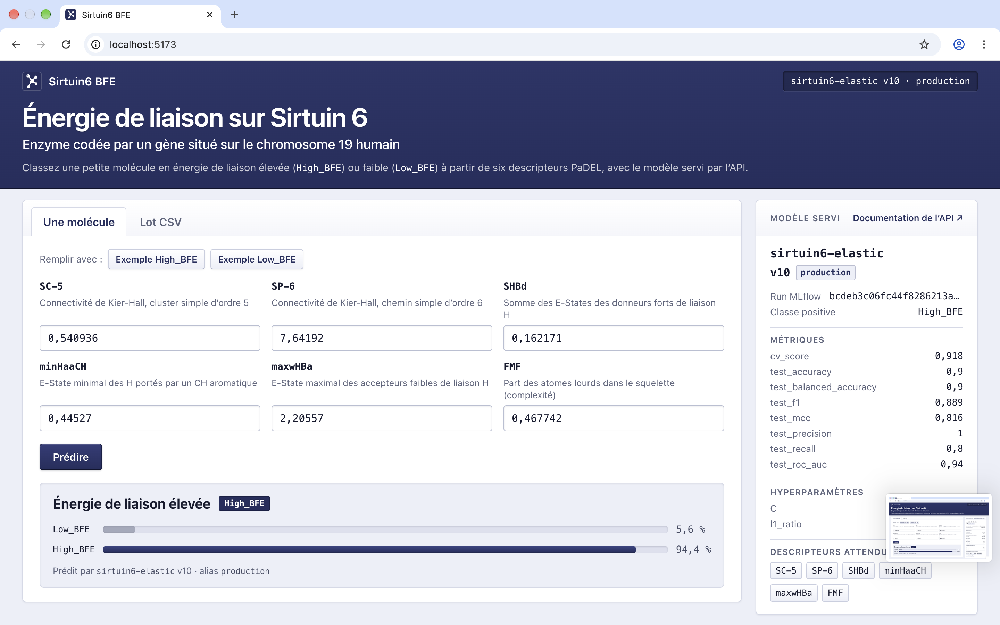

# Frontend : Sirtuin6 BFE

Interface web du modèle servi par l'API de serving.

- **Une molécule** : saisie des six descripteurs PaDEL, classe prédite et probabilité par classe.
- **Lot CSV** : prédiction d'un fichier entier, résultats téléchargeables en CSV.
- **Modèle servi** : version du registre MLflow, alias, run, métriques et hyperparamètres.

Chaque résultat indique la version du modèle qui l'a produit.



Pensé comme un dépôt à part : il ne connaît de l'API que son **URL** et son **contrat OpenAPI**,
jamais son code.

## Démarrer

Prérequis : Node 24 (`.nvmrc`), API de serving démarrée (par défaut sur `http://localhost:8001`).

```bash
npm ci
npm run dev        # http://localhost:5173
```

- Autre adresse d'API : copier `.env.example` en `.env.local` (ignoré par git) et ajuster
  `VITE_API_URL`.
- Le port 5173 est imposé (`strictPort`) : c'est l'origine autorisée par défaut par le CORS de
  l'API (`CORS_ORIGINS`). Si le port est pris, Vite échoue au lieu de basculer sur un port que
  l'API refuserait.

## Contrat avec l'API

Les types TypeScript de [src/api/schema.d.ts](src/api/schema.d.ts) sont **générés** depuis le
contrat publié par l'API, jamais écrits à la main :

```bash
npm run api:types                                   # contrat publié : ../src/deploying/openapi.json
OPENAPI_SPEC=<url ou chemin> npm run api:types      # autre source (API en marche, dépôt séparé…)
```

Quand le contrat change côté API (`make openapi` après une modification de `schemas.py`),
régénérer les types : `npm run build` échoue alors partout où le frontend n'est plus aligné
(descripteur renommé, champ de réponse retiré…). La CI vérifie que `schema.d.ts` est à jour.

## Lot CSV

Une ligne d'en-tête contenant les six descripteurs (`SC-5`, `SP-6`, `SHBd`, `minHaaCH`,
`maxwHBa`, `FMF`), puis une molécule par ligne. Les autres colonnes (par exemple `Class`) sont
ignorées. Séparateur virgule, ou point-virgule avec virgule décimale (export Excel français). Le fichier est
vérifié avant l'envoi : une colonne manquante ou une valeur non numérique est signalée avec
son numéro de ligne.

## Scripts

| Script | Rôle |
|---|---|
| `npm run dev` | Serveur de développement, rechargement à chaud |
| `npm run build` | Vérification des types puis build de production (`dist/`) |
| `npm run preview` | Sert le build de production sur le port 5173 |
| `npm run lint` | Oxlint |
| `npm run api:types` | Régénère les types depuis le contrat de l'API |

## Structure

```
src/
  api/client.ts        Appels à l'API, typés par le contrat
  api/schema.d.ts      Types générés depuis le contrat OpenAPI (ne pas modifier)
  components/          Formulaire, lot CSV, fiche du modèle, affichage des prédictions
  molecules.ts         Libellés des descripteurs (vérifiés contre le contrat), exemples du dataset
  csv.ts               Lecture du CSV d'entrée, export des prédictions
  index.css            Charte graphique (couleurs, typographie)
```

## Charte graphique

Une seule couleur d'accent : le bleu **R 0,150 · V 0,180 · B 0,370**, soit `#262E5E`, et sa
teinte claire `#EDEFF8` (fond de page, reliefs clairs). Les neutres sont légèrement teintés de ce
bleu. En mode sombre, le bandeau et les boutons gardent `#262E5E`, tandis que liens, onglets et barres
passent à `#98A2E1` (même teinte, éclaircie pour rester lisible sur fond sombre).

Les formes reprennent le web de 2010-2012, en version épurée : petits rayons (3 à 6 px), filets
de 1 px, boutons « vanilla » en léger dégradé avec reflet et filet plus sombre en bas (enfoncés à
l'appui), onglets attachés au contenu, champs et barres en creux, descripteurs en touches de
clavier. Couleurs, rayons et ombres sont des variables CSS dans [src/index.css](src/index.css).
